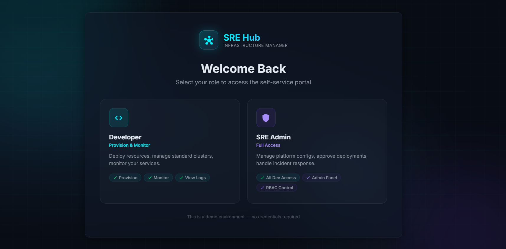
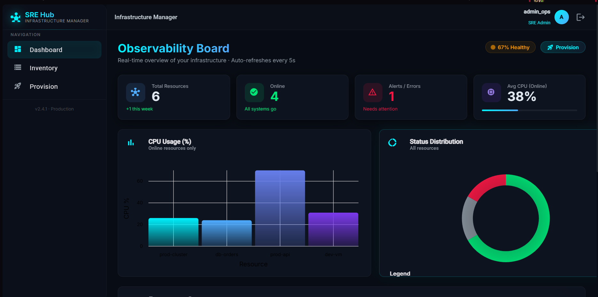
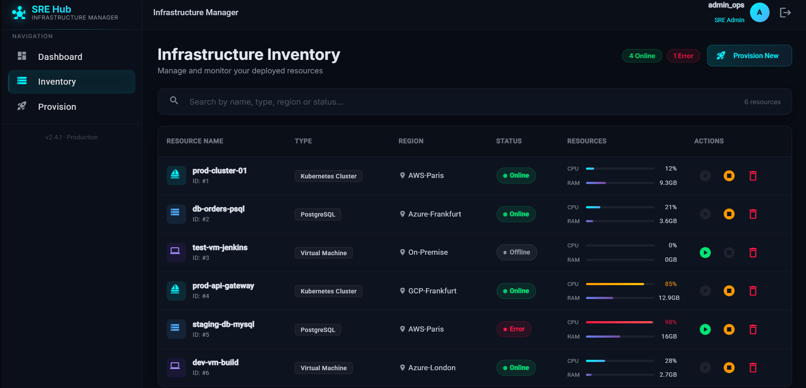
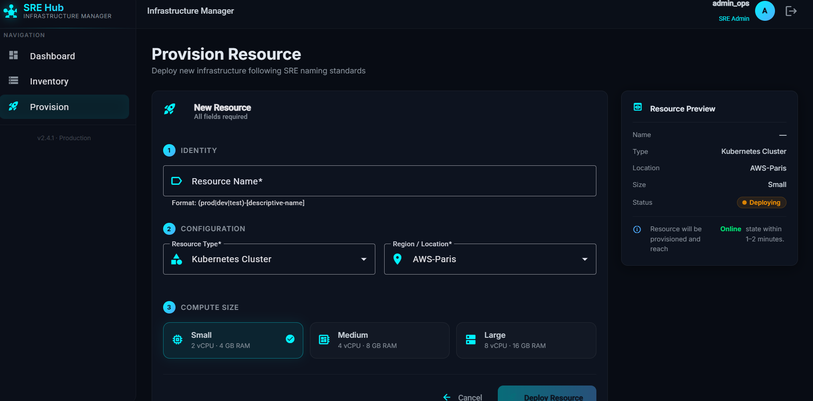

# SRE Portal - Portail d'Auto-Service Infrastructure

## 🎯 Description du Projet

**SRE Portal** est une plateforme d'auto-service moderne conçue pour les équipes **Site Reliability Engineering (SRE)** et les développeurs. Construite avec **Angular 21** et **Material Design**, cette application permet la gestion complète du cycle de vie des infrastructures cloud et on-premise.

### 📋 Objectif Principal
Fournir un portail self-service qui démocratise l'accès aux ressources d'infrastructure tout en maintenant les standards SRE, la sécurité et la traçabilité des déploiements.

### 👥 Utilisateurs Cibles
- **Développeurs** : Provisionnement et monitoring de ressources pour leurs projets
- **SRE Admins** : Gestion complète de la plateforme et supervision des déploiements

---

## ✨ Fonctionnalités Principales

### 🔐 Authentification et Autorisation
- **Connexion par rôle** : Sélection simple entre "Developer" et "SRE Admin"
- **Contrôle d'accès basé sur les rôles (RBAC)** : Permissions granulaires selon le profil utilisateur
- **Session persistante** : Maintien de la session utilisateur pendant la navigation

### 📊 Tableau de Bord Intelligent
- **Métriques en temps réel** : Visualisation des ressources actives, en erreur, hors ligne
- **Graphiques interactifs** : Charts CPU/Mémoire avec ngx-charts
- **Indicateurs de santé** : Pourcentage de disponibilité des services
- **Navigation fluide** : Accès rapide aux différentes sections

### 📋 Gestion d'Inventaire
- **Vue d'ensemble complète** : Liste paginée de toutes les ressources déployées
- **Recherche avancée** : Filtrage par nom, type, région ou statut
- **Informations détaillées** : CPU, RAM, localisation, statut opérationnel
- **Actions contextuelles** : Démarrage/arrêt des ressources selon leur état

### 🚀 Provisionnement de Ressources
- **Formulaire guidé** : Processus en 3 étapes pour le déploiement
- **Standards de nommage SRE** : Validation automatique des conventions (prod/dev/test)
- **Choix de configuration** : Type de ressource, région, taille de compute
- **Prévisualisation** : Aperçu avant déploiement avec estimation des ressources

### 🏗️ Types de Ressources Supportés
- **Clusters Kubernetes** : Pour les applications conteneurisées
- **Bases PostgreSQL** : Bases de données relationnelles managées
- **Machines Virtuelles** : Serveurs génériques pour workloads variés

### 🌍 Régions Disponibles
- **AWS-Paris** : Région Europe de l'Ouest
- **Azure-London** : Région Europe du Nord
- **GCP-Frankfurt** : Région Europe Centrale
- **On-Premise** : Infrastructure locale

---

## 🖼️ Captures d'Écran

### Instructions pour ajouter les captures d'écran :
1. **Démarrer l'application** : `npm start`
2. **Naviguer vers chaque page** et prendre des captures d'écran
3. **Enregistrer les images** dans le dossier `screenshots/` avec les noms suivants :
   - `login.png` - Page de connexion
   - `dashboard.png` - Tableau de bord
   - `inventory.png` - Inventaire des ressources
   - `deploy.png` - Formulaire de provisionnement

### 1. Page de Connexion

*Sélection du rôle utilisateur pour accéder au portail. Interface intuitive avec description des permissions pour chaque rôle.*

### 2. Tableau de Bord

*Vue d'ensemble des métriques infrastructure : nombre de ressources, utilisation CPU/Mémoire, graphiques interactifs et indicateurs de santé.*

### 3. Inventaire des Ressources

*Liste complète des ressources déployées avec recherche, filtrage et actions de gestion (démarrage/arrêt) selon le statut.*

### 4. Provisionnement de Ressources

*Formulaire de déploiement en 3 étapes : identité, configuration et taille. Validation des standards SRE et prévisualisation avant déploiement.*

---

## 🛠️ Architecture Technique

### Technologies Utilisées
- **Frontend** : Angular 21 (Signals, Standalone Components)
- **UI/UX** : Angular Material + Material Icons
- **Graphiques** : ngx-charts (basé sur D3.js)
- **Styling** : SCSS avec thème Material Design
- **Routing** : Angular Router avec composants standalone
- **Forms** : Reactive Forms avec validation personnalisée

### Structure des Composants
```
src/app/
├── components/
│   ├── login/           # Authentification par rôle
│   ├── dashboard/       # Métriques et visualisations
│   ├── item-list/       # Inventaire des ressources
│   └── item-create/     # Provisionnement
├── models/
│   └── resource.model.ts # Interface des ressources
├── services/
│   ├── auth.service.ts      # Gestion des utilisateurs
│   └── infrastructure.service.ts # Gestion des ressources
└── app.routes.ts        # Configuration du routage
```

### Modèle de Données
```typescript
interface Resource {
  id: number;
  name: string;
  type: 'Kubernetes Cluster' | 'PostgreSQL' | 'Virtual Machine';
  status: 'Online' | 'Offline' | 'Deploying' | 'Error' | 'Starting' | 'Stopping';
  cpuUsage: number; // en %
  memoryUsage: number; // en GB
  location: string; // ex: 'AWS-Paris', 'Azure-London'
}
```

### Patterns Architecturaux
- **Composants Standalone** : Indépendance et réutilisabilité
- **Services Injectables** : Logique métier centralisée
- **Signals Angular** : Réactivité moderne (remplace NgRx pour la simplicité)
- **Reactive Forms** : Validation et gestion d'état des formulaires

---

## 🎯 Standards SRE Implémentés

### Nommage des Ressources
- **Format** : `{environment}-{descriptive-name}`
- **Environnements** : `prod`, `dev`, `test`, `staging`
- **Validation** : Regex appliquée côté client et serveur

### Observabilité
- **Métriques temps réel** : CPU, mémoire, statut
- **Visualisations** : Graphiques interactifs avec ngx-charts
- **Alertes** : Indicateurs visuels pour les ressources en erreur

### Sécurité
- **RBAC** : Contrôle d'accès basé sur les rôles
- **Validation** : Sanitisation et validation des entrées
- **Audit** : Traçabilité des actions utilisateur

---

## 🚀 Comment Exécuter le Projet

### Prérequis
- **Node.js** 18+
- **npm** 11.6.2+
- **Angular CLI** 21.2.4

### Installation et Démarrage

1. **Cloner le dépôt** :
```bash
git clone https://github.com/yassinebenrayana-tech/sre-portal.git
cd sre-portal
```

2. **Installer les dépendances** :
```bash
npm install --legacy-peer-deps
```

3. **Démarrer le serveur de développement** :
```bash
npm start
```

4. **Accéder à l'application** :
Ouvrez votre navigateur à l'adresse : **http://localhost:4200/**

5. **Arrêter le serveur** :
Utilisez `Ctrl+C` dans le terminal

---

## 📖 Concepts Angular Illustrés

### 1. Directives Structurelles (@if et @for)
```html
<!-- Condition d'affichage dans dashboard.html -->
@if (errorResources() > 0) {
  <span class="error-badge">{{ errorResources() }} erreurs</span>
}

<!-- Boucle dans item-list.html -->
@for (resource of filteredResources(); track resource.id) {
  <tr class="resource-row">
    <td>{{ resource.name }}</td>
    <!-- ... autres colonnes -->
  </tr>
}
```

### 2. Interpolation {{ }}
```html
<!-- Affichage dynamique des métriques -->
<span class="metric-value">{{ totalResources() }}</span>
<span class="health-percentage">{{ healthPercentage() }}%</span>
```

### 3. Property Binding [ ]
```html
<!-- Liaison de classe conditionnelle -->
<div class="status-indicator"
     [class.online]="resource.status === 'Online'"
     [class.error]="resource.status === 'Error'">
  {{ resource.status }}
</div>

<!-- Liaison de valeur de formulaire -->
<input [value]="searchQuery()" (input)="onSearch($event)" />
```

### 4. Event Binding ( )
```html
<!-- Gestion des clics -->
<button (click)="startResource(resource.id)">Démarrer</button>
<button (click)="stopResource(resource.id)">Arrêter</button>

<!-- Gestion des changements de formulaire -->
<select (selectionChange)="onTypeChange($event.value)">
  <option value="kubernetes">Kubernetes Cluster</option>
</select>
```

### 5. Signals Angular (Réactivité Moderne)
```typescript
// Signaux pour l'état réactif
resources = signal<Resource[]>([]);
searchQuery = signal('');

// Computed pour les calculs dérivés
filteredResources = computed(() => {
  const query = this.searchQuery().toLowerCase();
  return this.resources().filter(r =>
    r.name.toLowerCase().includes(query)
  );
});
```

### 6. Reactive Forms
```typescript
// Formulaire de provisionnement
provisionForm = this.fb.group({
  name: ['', [Validators.required, this.namingValidator]],
  type: ['Kubernetes Cluster', Validators.required],
  location: ['AWS-Paris', Validators.required],
  size: ['small', Validators.required]
});
```

---

## 🎨 Design System

### Thème Material Design
- **Palette de couleurs** : Bleu primaire (#1976d2), accents verts/rouges pour les statuts
- **Typographie** : Roboto avec hiérarchie claire (h1-h6)
- **Composants** : Cards, boutons, tableaux, formulaires Material
- **Icônes** : Material Icons pour la cohérence visuelle

### Responsive Design
- **Mobile-first** : Adaptation automatique aux écrans mobiles
- **Breakpoints** : Support tablette et desktop
- **Navigation** : Optimisée pour le tactile

---

## 🔧 Scripts Disponibles

```json
{
  "start": "ng serve",           // Serveur de développement
  "build": "ng build",           // Build de production
  "watch": "ng build --watch",   // Build avec watch
  "test": "ng test",             // Tests unitaires
  "serve:ssr": "node dist/sre-portal/server/server.mjs"  // SSR
}
```

---

## 📊 Métriques et Monitoring

### Indicateurs Clés
- **Disponibilité** : Pourcentage de ressources opérationnelles
- **Performance** : Utilisation CPU/Mémoire moyenne
- **État des services** : Comptage par statut (Online/Error/Offline)
- **Temps de déploiement** : Estimation 1-2 minutes par ressource

### Visualisations
- **Graphiques en barres** : Utilisation CPU par ressource
- **Graphiques linéaires** : Utilisation mémoire
- **Camembert** : Répartition des statuts
- **Cartes KPI** : Métriques principales en évidence

---

## 🚀 Déploiement

### Build de Production
```bash
npm run build
```

### Serveur SSR (Server-Side Rendering)
```bash
npm run serve:ssr
```

### Docker
```dockerfile
# Stage 1: Build
FROM node:latest AS build
WORKDIR /app
COPY . .
RUN npm install && npm run build

# Stage 2: Serve avec Nginx
FROM nginx:alpine
COPY --from=build /app/dist/sre-portal/browser /usr/share/nginx/html
EXPOSE 80
```

**Démarrage du conteneur :**
```bash
docker build -t sre-portal .
docker run -p 80:80 sre-portal
```

---

## 🤝 Contribution

1. Fork le projet
2. Créer une branche feature (`git checkout -b feature/AmazingFeature`)
3. Commit les changements (`git commit -m 'Add some AmazingFeature'`)
4. Push vers la branche (`git push origin feature/AmazingFeature`)
5. Ouvrir une Pull Request

---

## 📄 Licence

Ce projet est sous licence MIT - voir le fichier [LICENSE](LICENSE) pour plus de détails.

---

## 👨‍💻 Auteur

**Yassine Ben Rayana**
- GitHub: [@yassinebenrayana-tech](https://github.com/yassinebenrayana-tech)
- LinkedIn: [Yassine Ben Rayana](https://linkedin.com/in/yassinebenrayana)

---

*Construit avec ❤️ utilisant Angular 21 et les meilleures pratiques SRE*